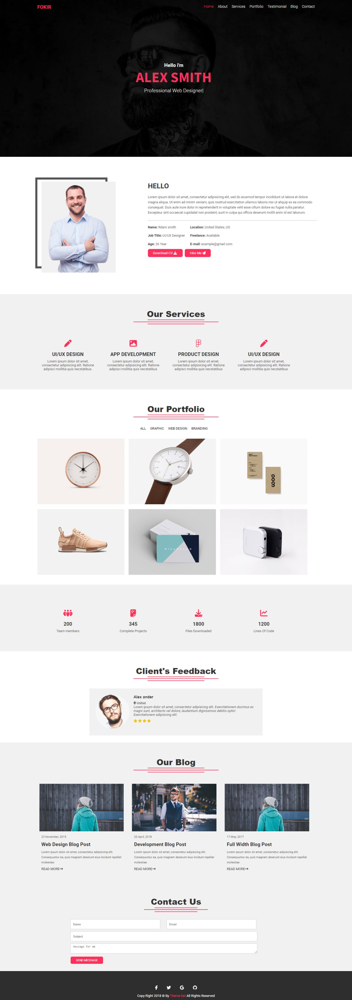

# Hi, I'm Ahmed! 👋

# Fokir

I'm thrilled to share that I've successfully completed my Second project at Route Academy About "Fokir Website"❤😍 
The Fokir project is a static website built using HTML and CSS, utilizing techniques such as float, position, and transition.

📌-Technologies Used:
- HTML
- CSS
- Font Awesome for Icons
- Google Fonts
- Smooth Transitions and hover
- Position

📌-It’s Not Responsive ❌
I enjoyed working on this project, implementing various technologies to create a visually appealing and interactive website. 
The use of CSS animations and smooth transitions adds a touch of elegance to the user experience.

 Don't forget to give me your feedback ❤️
 
🔗 Demo: 
https://lnkd.in/dYaz5rkf

🔗 Repo:
https://lnkd.in/dFGs6-qW

------

🔗 My account on GitHub :
[https://lnkd.in/dvei9dAh](https://github.com/ahmedmitwally77)
 

## 🛠 Skills
HTML, CSS...

## 🔗 Links

## Screenshots

